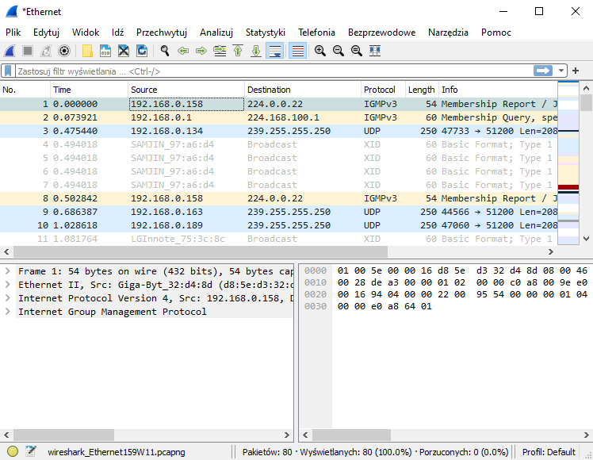

<script type="text/javascript"
  src="https://cdnjs.cloudflare.com/ajax/libs/mathjax/2.7.0/MathJax.js?config=TeX-AMS_CHTML">
</script>
<script type="text/x-mathjax-config">
  MathJax.Hub.Config({
    tex2jax: {
      inlineMath: [['$','$'], ['\\(','\\)']],
      processEscapes: true},
      jax: ["input/TeX","input/MathML","input/AsciiMath","output/CommonHTML"],
      extensions: ["tex2jax.js","mml2jax.js","asciimath2jax.js","MathMenu.js","MathZoom.js","AssistiveMML.js", "[Contrib]/a11y/accessibility-menu.js"],
      TeX: {
      extensions: ["AMSmath.js","AMSsymbols.js","noErrors.js","noUndefined.js"],
      equationNumbers: {
      autoNumber: "AMS"
      }
    }
  });
</script>

<div align="center">

# Technologie sieciowe 2023 - lista 1
Jakub Musiał 

<div align="left">

<br />

## **1. Ping**

Ping jest poleceniem używanym do diagonozowania połączeń sieciowych. Pozwala ono na sprawdzenie czy istnieje połączenie pomiędzy hostami, zmierzenie liczby zgubionych pakietów oraz opóźnień w ich transmisji.

Przykładowe wywołanie programu:

```
PS C:\Windows\system32> ping google.com

Pinging google.com [142.250.186.206] with 32 bytes of data:
Reply from 142.250.186.206: bytes=32 time=8ms TTL=58
Reply from 142.250.186.206: bytes=32 time=10ms TTL=58
Reply from 142.250.186.206: bytes=32 time=8ms TTL=58
Reply from 142.250.186.206: bytes=32 time=8ms TTL=58

Ping statistics for 142.250.186.206:
    Packets: Sent = 4, Received = 4, Lost = 0 (0% loss),
Approximate round trip times in milli-seconds:
    Minimum = 8ms, Maximum = 10ms, Average = 8ms
```

Program `ping` pozwala na sterowanie parametrami sygnałów echo wysyłanych do testowanego hosta. Takie parametry to np.:

* `-n <count>` - Liczba wysyłanych sygnałów echo ()
  
* `-i <ttl>` - TTL (Time To Live): liczba „przeskoków”, przez które pakiet ma istnieć w sieci, zanim zostanie odrzucony przez router

* `-l <size>` - Rozmiar wysyłanych pakietów (w bitach)

* `-f` - Blokuje fragmentowanie wysyłanych pakietów

* `-t` - Wysyła polecenie ping do określonego hosta, aż operacja zostanie zatrzymana

* `-w <time>` - Czas oczekiwania (w milisekundach) na odebranie komunikatu odpowiedzi od testowanego hosta

<br />

### **Liczba węzłów na trasie**

Żeby sprawdzić liczbę wezłów na trasie od hosta testującego do hosta testowanego należy przy wywołaniu polecenia `ping` określić wartość dla parametru `-i` (TTL). Liczbą węzłów na takiej trasie będzie maksymalna wartość TTL, dla której program otrzyma komunikat odpowiedzi od hosta testowanego.

Liczbę węzłów na trasie powrotnej można określić na podstawie wartości TTL zwracanej w odpowiedzi od hosta testowanego: `Reply from <ip>: bytes=<bytes> time=<time> TTL=<ttl>`. Znając wartość początkową TTL można wyznaczyć liczbę skoków na trasie powrotnej, odejmując od tej wartości początkowej wartość TTL zwróconą przez program ping. (Dla wyższego wywołania `ping google.com` będzie to $64 - 58 = 6$ skoków)

Porównanie liczby węzłów dla różnych hostów:

| Host | Lokalizacja | Liczba skoków do | Liczba skoków od | Opóźnienie |
| :-: | :-: | :-: | :-: | :-: |
| jsos.pwr.edu.pl | Wrocław | $7$ | $6$ | $5ms$ |
| uw.edu.pl | Warszawa | $13$ | $12$ | $50ms$ |
| berlin.de | Berlin | $19$ | $18$ | $172ms$ |
| visitlondon.uk | London | $18$ | $16$ | $65ms$ |
| google.com | Chicago, USA | $9$ | $6$ | $7ms$ |
| mit.edu | San Jose, USA | $10$ | $21$ | $175ms$ |
| 202.124.98.222 | Christchurch, New Zealand | $26$ | $22$ | $491ms$ |

Z powyższej tabeli można wywnioskować, że geograficzne położenie (odległość) hostów ma znaczenie dla trasy oraz opóźnienia przesyłanych informacji. Im większy dystans między hostami, tym tendencyjnie wiecej skoków będzie potrzebnych do przesłania komunikatu między nimi oraz przesył będzie miał większe opóźnienie.

Można także zauważyuć, nie zawsze liczba skoków (trasa) przesyłu będzie taka sama. Widać tu,że pakiety wysyłane do hosta `mit.edu` potrzebują 10 skoków, a z powrotem już 21 skoków, więc najprawdopodobniej wracając, pakiety te przebiegają przez sieć wirtualną.

Najdłuższa trasa, jaką udało mi się znaleźć prowadzi do hosta w Christchurch, New Zealand. Liczba skoków do hosta testowanego wynosi 26, a z powrotem jest to 22:

```
PS C:\WINDOWS\system32> ping 202.124.98.222 -i 26

Pinging 202.124.98.222 with 32 bytes of data:
Reply from 202.124.98.222: bytes=32 time=605ms TTL=42
Reply from 202.124.98.222: bytes=32 time=412ms TTL=42
Reply from 202.124.98.222: bytes=32 time=416ms TTL=42
Reply from 202.124.98.222: bytes=32 time=532ms TTL=42

Ping statistics for 202.124.98.222:
    Packets: Sent = 4, Received = 4, Lost = 0 (0% loss),
Approximate round trip times in milli-seconds:
    Minimum = 412ms, Maximum = 605ms, Average = 491ms
```

<br />

### **Rozmiar wysyłanych pakietów**

Wpływ rozmiaru pakietów na trasę i czas przesyłu

| Host | Rozmiar pakietu | Rozmiar zwróconych pakietów | TTL | Opóźnienie |
| :-: | :-: | :-: | :-: | :-: |
| jsos.pwr.edu.pl | $32$B | $32$B | $250$ | $1ms$ |
| jsos.pwr.edu.pl | $256$B | $256$B | $250$ | $2ms$ |
| jsos.pwr.edu.pl | $1472$B | $1472$B | $250$ | $5ms$ | 
| jsos.pwr.edu.pl | $1473$B | _Package needs to be fragmented_ | None | None | 
| mit.edu | $32$B | $32$B | $54$ | $43ms$ |
| mit.edu | $256$B | $256$B | $54$ | $43ms$ |
| mit.edu | $1472$B | $1472$B | $54$ | $43ms$ |
| mit.edu | $1473$B | _Package needs to be fragmented_ | None | None | 
| 202.124.98.222 | $32$B | $32$B | $44$ | $310ms$ |
| 202.124.98.222 | $256$B | $256$B | $44$ | $310ms$ |
| 202.124.98.222 | $1472$B | $1472$B | $44$ | $312ms$ |
| 202.124.98.222 | $1473$B | _Package needs to be fragmented_ | None | None | 

Można zauważyć, że wartością graniczną przesyłu niefragmentowanego pakietu są $1472$B (system Windows 10) (W testach dla systemu Ubuntu 22.04LTS wartość graniczna to $1412$B), a także że rozmiar pakietu nie ma wpływu na trasę którą pakiet jest przesyłany, ale ma za to wpływ na opóźnienie przesyłu (im większy pakiet, tym większe opóźnienie).

<br />

### **Fragmentacja pakietów**

Największy rozmiar pakietu, który udało mi się wysłać za pomocą programu ping to $65.5$kB:
```
PS C:\Windows\system32> ping mit.edu -l 65500

Pinging mit.edu [96.6.240.166] with 65500 bytes of data:
Reply from 96.6.240.166: bytes=65500 time=39ms TTL=52
Reply from 96.6.240.166: bytes=65500 time=39ms TTL=52
Reply from 96.6.240.166: bytes=65500 time=39ms TTL=52
Reply from 96.6.240.166: bytes=65500 time=39ms TTL=52

Ping statistics for 96.6.240.166:
    Packets: Sent = 4, Received = 4, Lost = 0 (0% loss),
Approximate round trip times in milli-seconds:
    Minimum = 39ms, Maximum = 39ms, Average = 39ms
```

Fragmentację pakietów wysyłanych przez program ping można sprawdzić, za pomocą programu WireShark. Żeby te zrobić należy w trakcie monitorowania sieci uruchomić program ping, a następnie w liście pakietów wybrać odpowiedni pakiet sygnału echo. W sekcji szegółów pakietu pokażą się informacje odności fragmentacji danego pakietu.

<br />
<br />
<br />

## **2. Tracert**

Program tracert (treaceroute) pozwala na sprawdzenie trasy, jaką przesyłane sa pakiety wysyłane do docelowego serwera. Żeby wygenerować taką trasę program ten wysyła pakiety inkrementując ich TTL, więc przesyłane pakiety są odrzucane przez kolejne rutery, dzieki czemu otrzymujemy informację, przez jakie rutery przechodzą przesyłane pakiety.

Przykładowe wywołanie programu:

```
PS C:\Windows\system32> tracert mit.edu

Tracing route to mit.edu [96.6.240.166]
over a maximum of 30 hops:

  1    <1 ms    <1 ms    <1 ms  dlinkrouter846C.local [192.168.0.1]
  2     1 ms     1 ms    <1 ms  90-156-102-1.internetia.net.pl [90.156.102.1]
  3     8 ms     6 ms     5 ms  host-87-99-33-89.internetia.net.pl [87.99.33.89]
  4     5 ms     5 ms     4 ms  JAWOH001RT09.inetia.pl [83.238.249.43]
  5     7 ms     7 ms     7 ms  83.238.248.81
  6     *       24 ms    24 ms  Te4-4-car2.prg1.Level3.net [212.162.8.173]
  7     *       41 ms    41 ms  ae1.3110.ear4.London2.level3.net [4.69.201.106]
  8    43 ms    43 ms    46 ms  212.187.218.206
  9     *        *        *     Request timed out.
 10    44 ms    37 ms    37 ms  a96-6-240-166.deploy.static.akamaitechnologies.com [96.6.240.166]

Trace complete.
```

`*` Widoczne w zwracanym przez program `tracert` wyniku oznaczają, że serwer nie odpowiedział w ciągu limitu czasu oczekiwania


Wywołując program tracert można specyfikować parametry takie, jak:

* `-h <count>` - Maksymalna liczba skoków
* `-w <time>` - Czas oczekiwania (w milisekundach) na każdą odpowiedź

<br />
<br />
<br />

## **3. WireShark**

WireShark to program, który służy do monitorowania ruchu w sieciowego na danym urzadzeniu. Zwraca on chronologicznie pakiety wysyłane i odbierane przez używane w systemie urządzenia sieciowe, analizuje je i wyświetla podstawowe informacje ich dotyczące takie jak źródło, cel, długość, protokół, itp. Pozwala też przeczytać treść tych pakietów. Przy pomocy tego programu można monitorować cały lub ograniczony (ustawianymi flagami / filtrami) ruch sieciowy na danym urządzeniu.

<div align="center">



<div align="left">