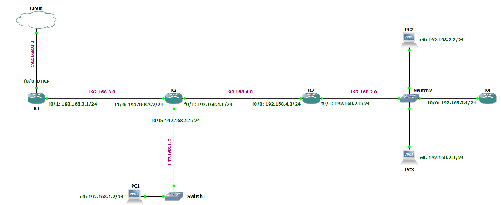

<div align="center">

# Technologie sieciowe - lab 4

Jakub Musiał 268442

<div align="left">

<br />

## Konfiguracja sieci

<div align="center">



<div align="left">

<br />
<br />

1. Komputery

   * PC1

   ```
   ip 192.168.1.2/24 192.168.1.1
   ip dns 8.8.8.8
   ```

   > `ip 192.168.1.2/24 192.168.1.1` 
   > 
   > * Ustawienie adresu IPv4 na 192.168.1.2
   > * Ustawienie maski podsieci na 255.255.255.0 (24)
   > * Ustawienie bramy domyślnej na 192.168.1.1

   > `ip dns 8.8.8.8` - stawienie adresu serwera DNS na 8.8.8.8

   * PC2

   ```
   ip 192.168.2.2/24 192.168.2.1
   ip dns 8.8.8.8
   ```

   * PC3

   ```
   ip 192.168.2.3/24 192.168.2.1
   ip dns 8.8.8.8
   ```

<br />
<br />

1. Routery

   * R1

   ```
   conf t
   int f2/0
   ip address dhcp
   ip nat outside
   no shut
   end

   conf t
   ip domain-lookup
   ip name-server 8.8.8.8
   end

   conf t
   int f0/0
   ip add 192.168.3.1 255.255.255.0
   ip nat inside
   no shut
   end

   conf t
   router rip
   version 2
   no auto-summary
   network 192.168.0.0
   network 192.168.3.0
   default-in
   default-information originate
   end

   conf t
   access-list 10 permit 192.168.1.0 0.0.254.255
   access-list 10 permit 192.168.2.0 0.0.253.255
   access-list 10 permit 192.168.3.0 0.0.252.255
   access-list 10 permit 192.168.4.0 0.0.251.255
   ip nat inside source list 10 interface f2/0 overload
   end

   write
   ```

    > `conf t` - confiogure terminal (wejście w tryb konfiguracji)
    >
    > `intf2/0` - interface FastEthernet0/0 (konfiguracja konkretnego interfejsu)
    > 
    > `ip adress dhcp` - ustawienie pobierania adresu z serwera DHCP
    > 
    > `ip nat outside` - wskazanie, że ruch wchodzący do interfejsu podlega NAT
    > 
    > `no shut` - no shutdown (włączenie intefejsu)
    >
    > `end` - wyjście z trybu konfiguracji

    > `ip domain-lookup` - włącznie funkcji wyszukiwaania DNS
    > 
    > `ip name-server 8.8.8.8` - ustawienie adresu serwera DNS na 8.8.8.8
    
    > `ip add 192.168.3.1 255.255.255.0` 
    > * ustawienie statycznego adresu IP na 192.168.3.1
    > * ustawienie maski podsieci na 255.255.255.0 (24)
    > 
    > `ip nat inside` - wskazanie, że ruch wychodzący z interfejsu podlega NAT

    > `router rip` - włączenie procesu routingu protokołu RIP (protokół ustalania tras), a tym samym wejście w tryb konfigurowania routera
    > 
    > `version 2` - ustawienie obsługi pakietów RIP jedynie w wersji 2
    > 
    > `no auto summary` - wyłączenie automatycznego podsumowywania
    > 
    > `network 192.168.0.0` - powiązanie sieci 192.168.0.0 z procesem routingu 
    > 
    > `default-information originate` - wygenerowanie automatycznej trasy do RIP

    > `ip nat inside source list 10 interface f0/0 overload`
    > * ustawienie dynamicznej translacji źródła 
    > * opcja „list” pozwala na identyfikacji ruchu podlegającego NAT 
    > * overload umożliwia routerowi użycie jednego adresu globalnego dla wielu adresów lokalnych


   * R2

   ```
   conf t
   int f0/0
   ip add 192.168.3.2 255.255.255.0
   no shut
   end

   conf t
   int e1/1
   ip add 192.168.4.1 255.255.255.0
   no shut
   end

   conf t
   int f2/0
   ip add 192.168.1.1 255.255.255.0
   no shut
   end

   conf t
   router rip
   version 2
   no auto-summary
   network 192.168.1.0
   network 192.168.4.0
   network 192.168.3.0
   end

   conf t
   ip domain-lookup source-interface f0/0
   ip name-server 8.8.8.8
   end

   write
   ```

   > `ip domain-lookup source-interface f0/0` - włączenie funkcji wyszukiwania DNS na danym interfejsie


   * R3

   ```
   conf t
   int f0/0
   ip add 192.168.4.2 255.255.255.0
   no shut
   int f2/0
   ip add 192.168.2.1 255.255.255.0
   no shut
   end

   conf t
   router rip
   version 2
   no auto-summary
   network 192.168.4.0
   network 192.168.2.0
   end

   conf t
   ip domain-lookup
   ip name-server 8.8.8.8
   end

   write
   ```

   * R4

   ```
   conf t
   int f0/0
   ip add 192.168.2.3 255.255.255.0
   no shut
   end

   conf t
   router rip
   version 2
   no auto-summary
   network 192.168.2.0
   end

   conf t
   ip domain-lookup
   ip name-server 8.8.8.8
   end

   write
   ```